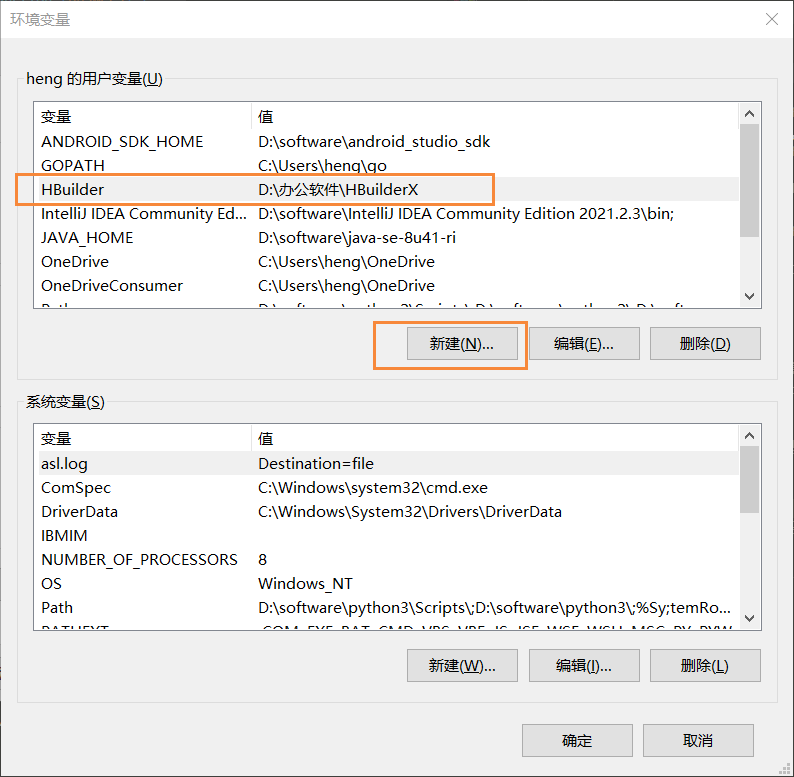

# 全局安装

```
npm i -g @adtkcn/hb-cli
```
# 功能
1. 简化打包安卓、ios,本地打包App资源、wgt包
2. 切换环境变量，根据配置中`hb_cli.env.*`生成js文件
3. 切换不同配置参数，根据配置中`hb_cli.HBuilderConfig.*`生成不同的配置文件
4. 更改版本号
5. wifi调试
6. 自动下载ios包到本地
7. 自动上传安装包到`hb_cli.upload.url`指定的地址

## 更新日志
[change.md](./change.md)

# 运行

1. 全局安装 @adtkcn/hb-cli
2. 在项目下创建 HBuilderConfig.json
3. 系统变量里加入 HBuilder，指向 HBuilder 安装目录

4. 在项目下运行命令
```bash
hb-cli
```

# HBuilderConfig.json，内容如下:

https://hx.dcloud.net.cn/cli/pack?id=config

除了`hb_cli`都是官方配置

```json5
{
  //项目的目录名字或项目绝对路径
  "project": "",
  //打包平台 默认值android  值有"android","ios" 如果要打多个逗号隔开打包平台
  "platform": "android,ios",
  //是否使用自定义基座 默认值false  true自定义基座 false自定义证书
  "iscustom": false,
  //打包方式是否为安心打包默认值false,true安心打包,false传统打包
  "safemode": true,
  //android打包参数
  "android": {
    //安卓包名
    "packagename": "",
    //安卓打包类型 默认值0 0 使用自有证书 1 使用公共证书 2 使用老版证书 3 在线证书
    "androidpacktype": "3",
    //安卓使用自有证书自有打包证书参数
    //安卓打包证书别名,自有证书打包填写的参数
    "certalias": "",
    //安卓打包证书文件路径,自有证书打包填写的参数,  -------------相对路径(官方本身配置需要绝对路径,我考虑到切换电脑不方便,改为相对路径)-----
    "certfile": "",
    //安卓打包证书密码,自有证书打包填写的参数
    "certpassword": "",
    //安卓平台要打的渠道包 取值有"google","yyb","360","huawei","xiaomi","oppo","vivo"，如果要打多个逗号隔开
    "channels": "",
  },
  //ios打包参数
  "ios": {
    //ios appid
    "bundle": "",
    //ios打包支持的设备类型 默认值iPhone 值有"iPhone","iPad" 如果要打多个逗号隔开打包平台
    "supporteddevice": "iPhone,iPad",
    //iOS打包是否打越狱包,只有值为true时打越狱包,false打正式包
    "isprisonbreak": false,
    //iOS使用自定义证书打包的profile文件路径
    "profile": "", //-----相对路径(官方本身配置需要绝对路径,我考虑到切换电脑不方便,改为相对路径)-----
    //iOS使用自定义证书打包的p12文件路径
    "certfile": "", //-----相对路径(官方本身配置需要绝对路径,我考虑到切换电脑不方便,改为相对路径)-----
    //iOS使用自定义证书打包的证书密码
    "certpassword": "",
  },
  //是否混淆 true混淆 false关闭
  "isconfusion": false,
  //开屏广告 true打开 false关闭
  "splashads": false,
  //悬浮红包广告true打开 false关闭
  "rpads": false,
  //push广告 true打开 false关闭
  "pushads": false,
  //加入换量联盟 true加入 false不加入
  "exchange": false,

  "hb_cli": {
    "upload": {
      "url": "http://127.0.0.1:1080/api/file/upload",
      "formData": {} //上传附加内容，文件是file
    },
    "HBuilderConfig": {
      // 基础,其他任意选项会合并base变量
      // HBuilderConfig 属性，可定义上方除hb_cli的所有属性，以实现切换证书之类的操作
      "base": {
        "project": "消息订阅2",
        "android": {
          "packagename": "cn.adtk.base"
        }
      },
      "prod": {
        "project": "消息订阅3",
        "android": {
          "packagename": "cn.adtk.prod"
        }
      }
    },
    "env": {
      "base": {
        // 基础,其他任意选项会合并base变量
        // 实现app内切换环境变量
  
        "url": "https://base.adtk.cn",
        "a": 123
      },
      "prod": { //合并基础
        "url": "https://prod.adtk.cn"
      }
    }
  }
}
```
## 配置文件说明

`hb_cli` 目录是本插件自定义属性，可忽略，其他都是hbuilder官方配置

`hb_cli.upload.url` 上传接口路径： 如果配置，将会自动上传

`hb_cli.upload.formData` 上传接口附带内容formData
 
`hb_cli.env` 环境变量，执行hb-cli命令时选择`环境变量`,将会选择对应的key，选择任意key都会合并base对象，生成HBuilderEnv.js文件

`hb_cli.HBuilderConfig` 对hbuilder官方配置项进行替换，实现多配置


## Git需要忽略的文件
```
.hbuilderx/HBuilderConfigTemp.json
.hbuilderx/IpFile.json
```

wifi调试原理
```
D:\办公软件\HBuilderX\plugins\launcher\tools\adbs\adb.exe tcpip 5555
D:\办公软件\HBuilderX\plugins\launcher\tools\adbs\adb.exe connect 192.168.3.2
```